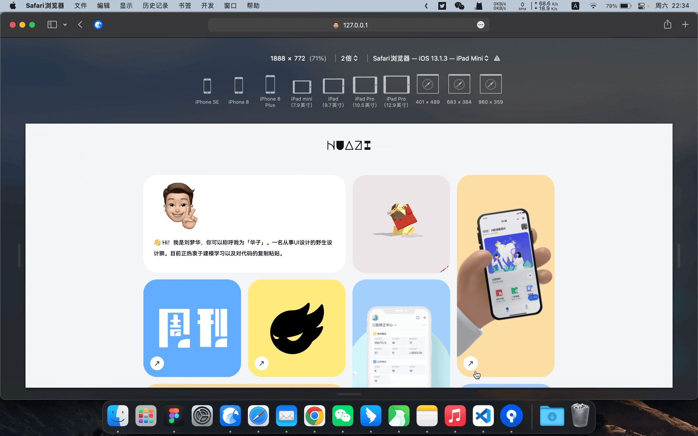

# 🧑‍💻 响应式简约个人网站

### 预览地址
http://practice.huazi.space
### 设计图地址  
figma: https://www.figma.com/community/file/1103313265792067217  
即时设计：https://js.design/resourceDetails?id=623873209d3ddaa7576a9e65
## 关于
网站借鉴（~~抄~~）国外设计师[nev的个人主页](https://nevflynn.com/) 
因为个人代码实力有限，只粗略实现了简易效果，各位大佬轻喷。

## 该网站使用以下开源项目
|  小狮子   | 书籍翻页  |
|  ----  | ----  |
|   |  |
